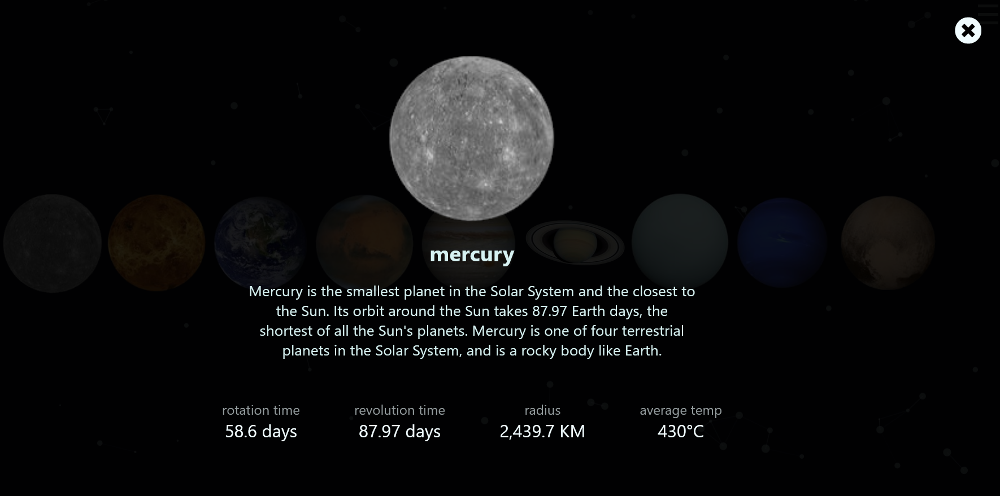

# Planets 

This simple web app was built with React JS, using particles and CSS animation.

## [Live demo](https://versi-on.github.io/planets/)

## Preview of all planets

### Preview of specific planet

